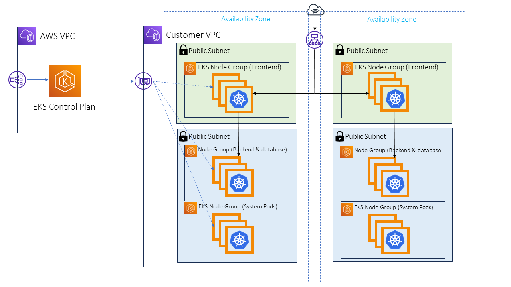

## 3-Tier Application on Amazon EKS with Monitoring and CI/CD Pipelines

This document outlines a multi-tenant architecture for a 3-tier web application deployed on Amazon Elastic Kubernetes Service (EKS) across two Virtual Private Clouds (VPCs). It leverages Infrastructure as Code (IaC) and CI/CD pipelines for automated infrastructure provisioning and application deployment.

### Architecture

**Key Components:**

* **EKS Control Plane (VPC 1):** Managed by AWS, it includes the API server, etcd (cluster state storage), and the scheduler. Secured using security groups.
* **Worker Nodes (VPC 2):** Divided into Node Groups based on function:
    * **Frontend:** Public subnets, handling user interface or API requests.
    * **Backend & Database:** Public subnets, managing application logic and data storage.
    * **System Pods:** Private subnets (optional, enhanced security), running essential Kubernetes system components.
    * Security Groups control inbound and outbound traffic for each node group.

**High Availability:** Spans two Availability Zones, ensuring redundancy in case of zone failure.

**Security Considerations:**

* Public Node Groups: Consider placing backend and database nodes in private subnets for added security.
* Load Balancers: Distribute traffic across nodes and enhance fault tolerance.

### Monitoring with Prometheus and Grafana

* **Prometheus:** Open-source monitoring toolkit, collects metrics from various sources (Kubernetes components, applications) and stores them in a time-series database.
* **Grafana:** Open-source visualization and analytics platform, creates dashboards to display metrics collected by Prometheus.

### CI/CD Pipelines

* **Terraform Workflow:** Provisions and manages infrastructure on AWS using Terraform and Kubernetes.
    * Automates EKS cluster creation, VPCs, subnets, security groups, and node groups.
* **Frontend CI/CD Workflow:**
    * Triggers on code push or manually.
    * Performs code quality and security scans using SonarQube and Trivy.
    * Builds and pushes Docker image to ECR.
    * Deploys the application to the EKS cluster using kubectl.
* **Backend CI/CD Workflow:** Similar to frontend workflow, focusing on backend application.
* **K8S Manifest Workflow:**
    * Deploys the application and monitoring stack (Prometheus & Grafana) on the EKS cluster.
    * Uses Helm charts for streamlined installation and management.

**Benefits:**

* **Automation:** Streamlined infrastructure provisioning and application deployment.
* **Scalability:** Node groups allow for independent scaling of application tiers.
* **Security:** Separation of control plane and worker nodes in different VPCs enhances security. Security groups and potential private subnets for backend/database provide additional control.
* **Monitoring:** Gain insights into cluster health and performance through Prometheus and Grafana.